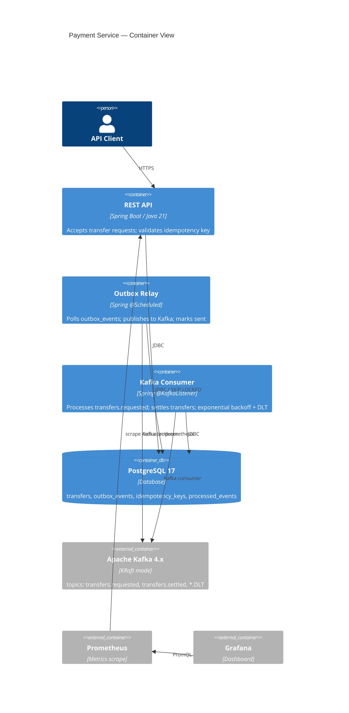

# C4 Container Diagram

```mermaid
C4Container
    title Payment Service — Container View

    Person(client, "API Client")

    Container(api, "REST API", "Spring Boot / Java 21", "Accepts transfer requests; validates idempotency key")
    Container(relay, "Outbox Relay", "Spring @Scheduled", "Polls outbox_events; publishes to Kafka; marks sent")
    Container(consumer, "Kafka Consumer", "Spring @KafkaListener", "Processes transfers.requested; settles transfers; exponential backoff + DLT")

    ContainerDb(postgres, "PostgreSQL 17", "Database", "transfers, outbox_events, idempotency_keys, processed_events")
    Container_Ext(kafka, "Apache Kafka 4.x", "KRaft mode", "topics: transfers.requested, transfers.settled, *.DLT")
    Container_Ext(prometheus, "Prometheus", "Metrics scrape")
    Container_Ext(grafana, "Grafana", "Dashboard")

    Rel(client, api, "HTTPS")
    Rel(api, postgres, "JDBC")
    Rel(relay, postgres, "JDBC / SKIP LOCKED")
    Rel(relay, kafka, "Kafka producer")
    Rel(consumer, kafka, "Kafka consumer")
    Rel(consumer, postgres, "JDBC")
    Rel(prometheus, api, "scrape /actuator/prometheus")
    Rel(grafana, prometheus, "PromQL")
```
