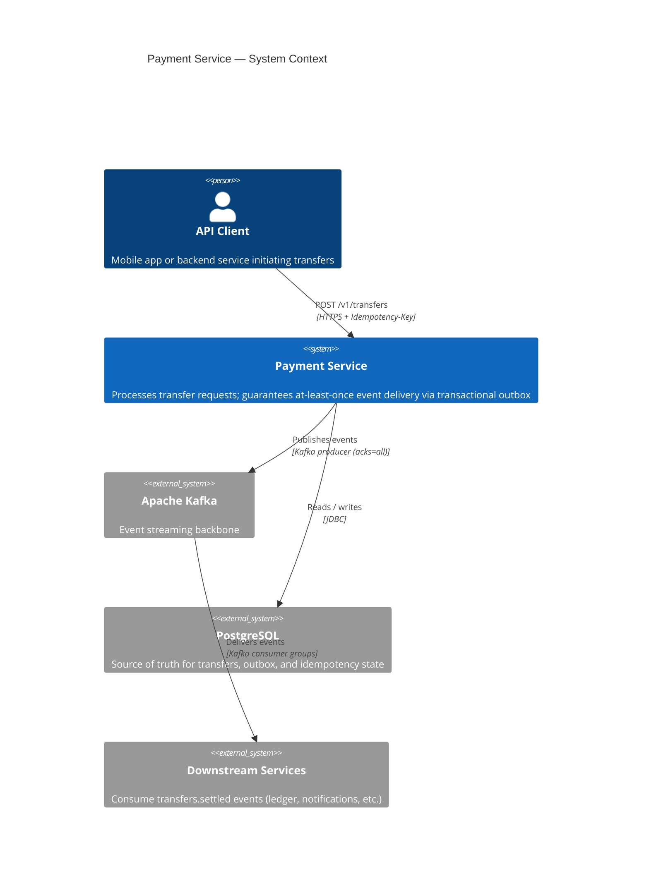

# C4 Context Diagram

```mermaid
C4Context
    title Payment Service — System Context

    Person(client, "API Client", "Mobile app or backend service initiating transfers")

    System(paymentService, "Payment Service", "Processes transfer requests; guarantees at-least-once event delivery via transactional outbox")

    System_Ext(kafka, "Apache Kafka", "Event streaming backbone")
    System_Ext(postgres, "PostgreSQL", "Source of truth for transfers, outbox, and idempotency state")
    System_Ext(downstream, "Downstream Services", "Consume transfers.settled events (ledger, notifications, etc.)")

    Rel(client, paymentService, "POST /v1/transfers", "HTTPS + Idempotency-Key")
    Rel(paymentService, postgres, "Reads / writes", "JDBC")
    Rel(paymentService, kafka, "Publishes events", "Kafka producer (acks=all)")
    Rel(kafka, downstream, "Delivers events", "Kafka consumer groups")
```
