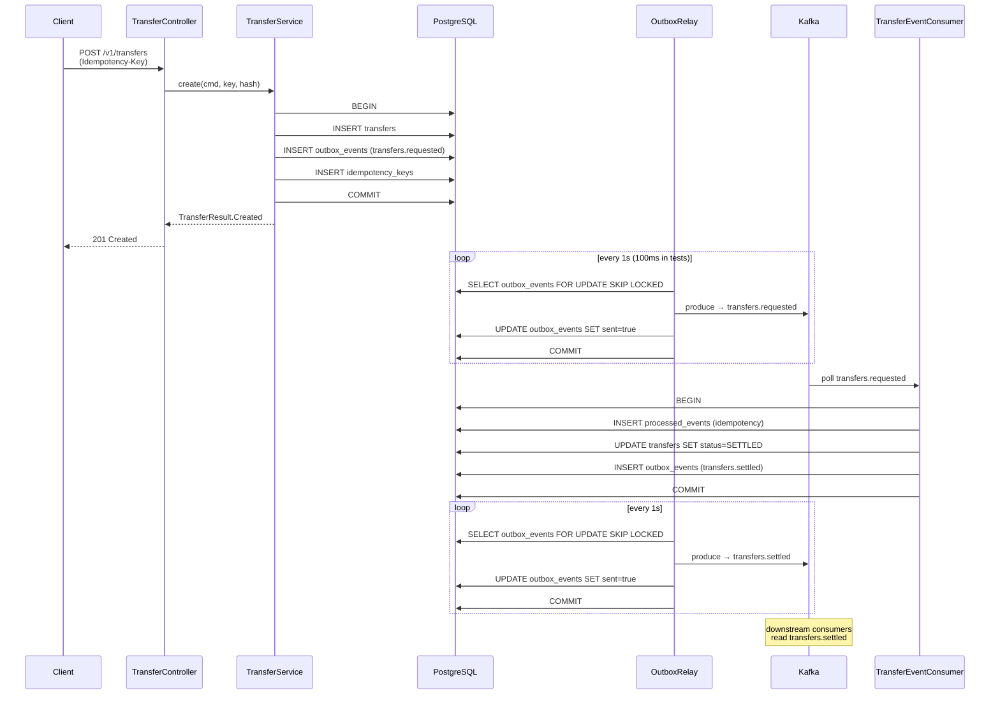

# Transfer Flow — Sequence Diagram

```mermaid
sequenceDiagram
    participant C as Client
    participant API as TransferController
    participant SVC as TransferService
    participant DB as PostgreSQL
    participant RELAY as OutboxRelay
    participant K as Kafka
    participant CONS as TransferEventConsumer

    C->>API: POST /v1/transfers<br/>(Idempotency-Key)
    API->>SVC: create(cmd, key, hash)
    SVC->>DB: BEGIN
    SVC->>DB: INSERT transfers
    SVC->>DB: INSERT outbox_events (transfers.requested)
    SVC->>DB: INSERT idempotency_keys
    SVC->>DB: COMMIT
    SVC-->>API: TransferResult.Created
    API-->>C: 201 Created

    loop every 1s (100ms in tests)
        RELAY->>DB: SELECT outbox_events FOR UPDATE SKIP LOCKED
        RELAY->>K: produce → transfers.requested
        RELAY->>DB: UPDATE outbox_events SET sent=true
        RELAY->>DB: COMMIT
    end

    K->>CONS: poll transfers.requested
    CONS->>DB: BEGIN
    CONS->>DB: INSERT processed_events (idempotency)
    CONS->>DB: UPDATE transfers SET status=SETTLED
    CONS->>DB: INSERT outbox_events (transfers.settled)
    CONS->>DB: COMMIT

    loop every 1s
        RELAY->>DB: SELECT outbox_events FOR UPDATE SKIP LOCKED
        RELAY->>K: produce → transfers.settled
        RELAY->>DB: UPDATE outbox_events SET sent=true
        RELAY->>DB: COMMIT
    end

    Note over K: downstream consumers<br/>read transfers.settled
```
